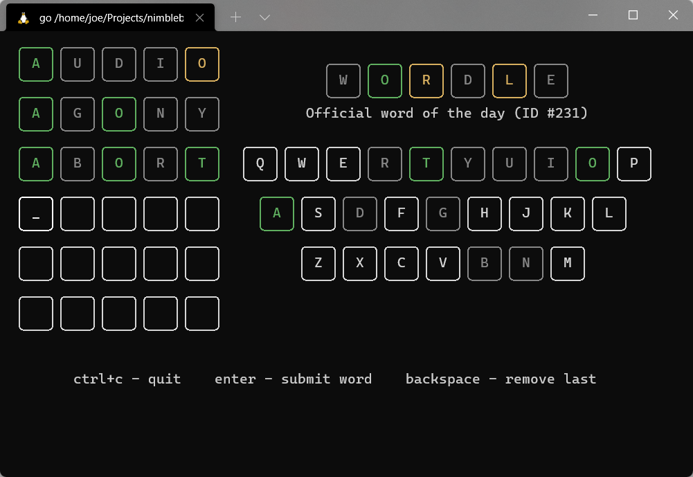
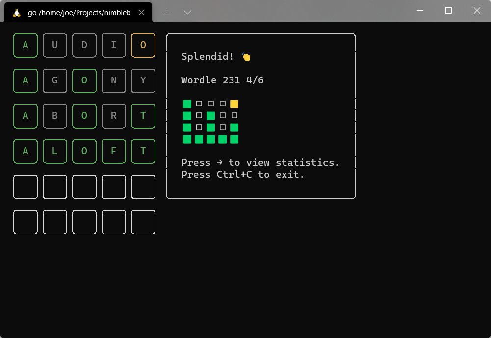
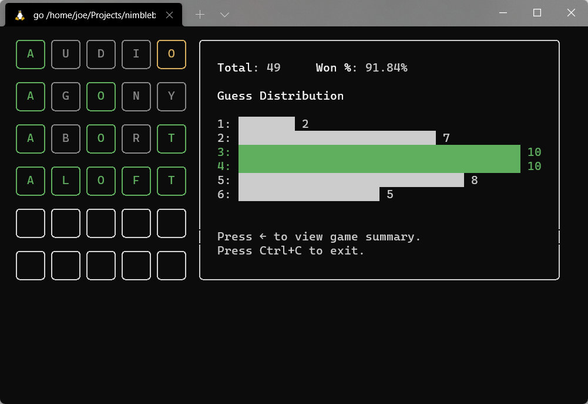

# Wordle CLI

Play Wordle in your command line!

## Screenshots







## Download

You can download the latest binary from the [GitHub releases page][gh-releases].
Placing the binary somewhere in your `PATH` will make it available system-wide.

### For Debian users

If you have Debian or a Debian-based system, you can use our Debian package
repository to install and update Wordle CLI globally.

Run the following commands in succession:

```sh
echo "deb https://deb.nimblebun.works/debian stable main" | sudo tee /etc/apt/sources.list.d/nimblebun.list
sudo apt-key adv --keyserver keyserver.ubuntu.com --recv-keys 033D0D4895F432D1
sudo apt update
sudo apt install wordle-cli
```

### For Arch Linux users

If you have Arch Linux or an Arch-based system (e.g. Manjaro), you can install
Wordle CLI globally through [AUR][aur-link].

Example using `yay`:

```sh
yay -S wordle-cli-bin
```

## Usage

```sh
./wordle          # play today's official word
./wordle daily    # play today's Wordle CLI word
./wordle random   # play a random word
```

In-game you can press <kbd>Ctrl</kbd><kbd>C</kbd> to quit anytime. You can press
<kbd>Enter</kbd> to validate your current word (note: invalid words will not be
validated). Pressing <kbd>Backspace</kbd> will remove the last letter.

Once you're on the finish screen you can use the <kbd>→</kbd> key to view your
statistics for the chosen Wordle type. You can then use the <kbd>←</kbd> key to
return to the game overview. _Note: random mode does not have statistics._

In random mode, you can press <kbd>Ctrl</kbd><kbd>N</kbd> on the finish screen
to play a new random word.

## Credits

- [Charm](https://charm.sh/): TUI and tooling
- [Official Wordle](https://www.powerlanguage.co.uk/wordle/)

## License

[MIT](https://github.com/nimblebun/wordle-cli/blob/master/LICENSE).

[gh-releases]: https://github.com/nimblebun/wordle-cli/releases/latest
[aur-link]: https://aur.archlinux.org/packages/wordle-cli-bin
